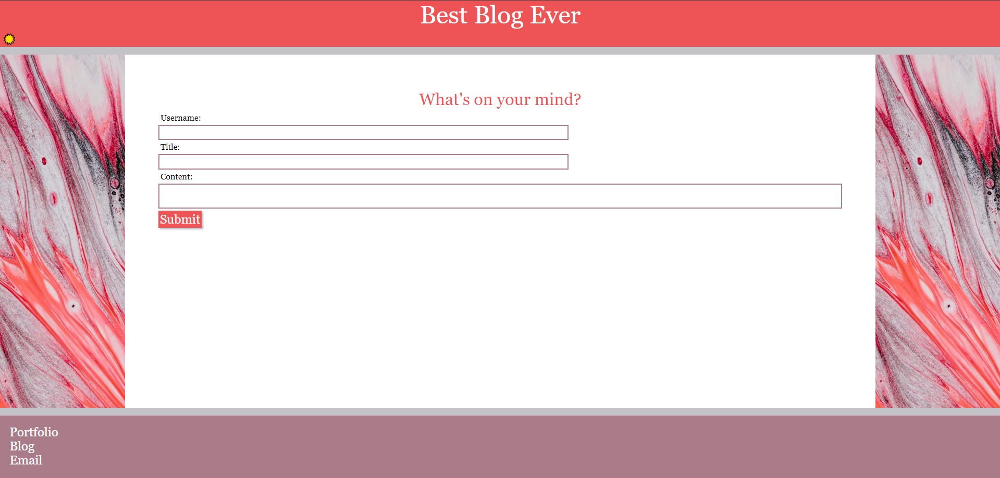

# Best-Blog-Ever

## Description
The Best Blog Ever is an application that allows people to write and post blog posts, entering their username, a title, and the blog post content.

## Installation
N/A

## Usage
To use this application

Here is the link to deploy the application:

https://hannahpsmith.github.io/Best-Blog-Ever/

